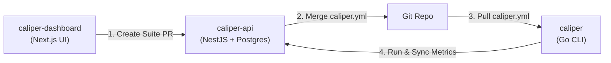

# Welcome to Caliper (`caliper-hq`) 🎯

**Caliper** is the open-source, Git-native LLM evaluation ecosystem built for developers, AI engineers, and product teams. 

---

## 🏛️ Ecosystem Overview

### Core Repositories

| Repository | Tech Stack | Role & Function |
| :--- | :--- | :--- |
| **[caliper](https://github.com/caliper-hq/caliper)** | Go 1.26+ | Fast, local CLI runner for LLM evaluations & CI/CD integration |
| **[caliper-api](https://github.com/caliper-hq/caliper-api)** | NestJS + PostgreSQL | Control plane API: run history storage, metrics aggregation, Git PR automation |
| **[caliper-dashboard](https://github.com/caliper-hq/caliper-dashboard)** | Next.js 15 + Tailwind | Visual suite editor for datasets, prompt templates, and evaluation rules |

---

## 🔥 Key Advantages

1. **Git-Native & Declarative**: Test suites live as `caliper.yml` in your code repositories. Prompt iterations go through standard Git pull request reviews.
2. **Privacy & Speed**: Run evaluation suites locally or in self-hosted CI/CD runners without exposing sensitive enterprise prompts to third-party SaaS vendors.
3. **No Vendor Lock-In**: Decoupled visual playground (Dashboard) -> Control plane (API) -> Command line (CLI).

---

## 👥 Community & License

All Caliper projects are licensed under the [MIT License](https://opensource.org/licenses/MIT).
We welcome contributions, bug reports, and feature requests across all repositories!
