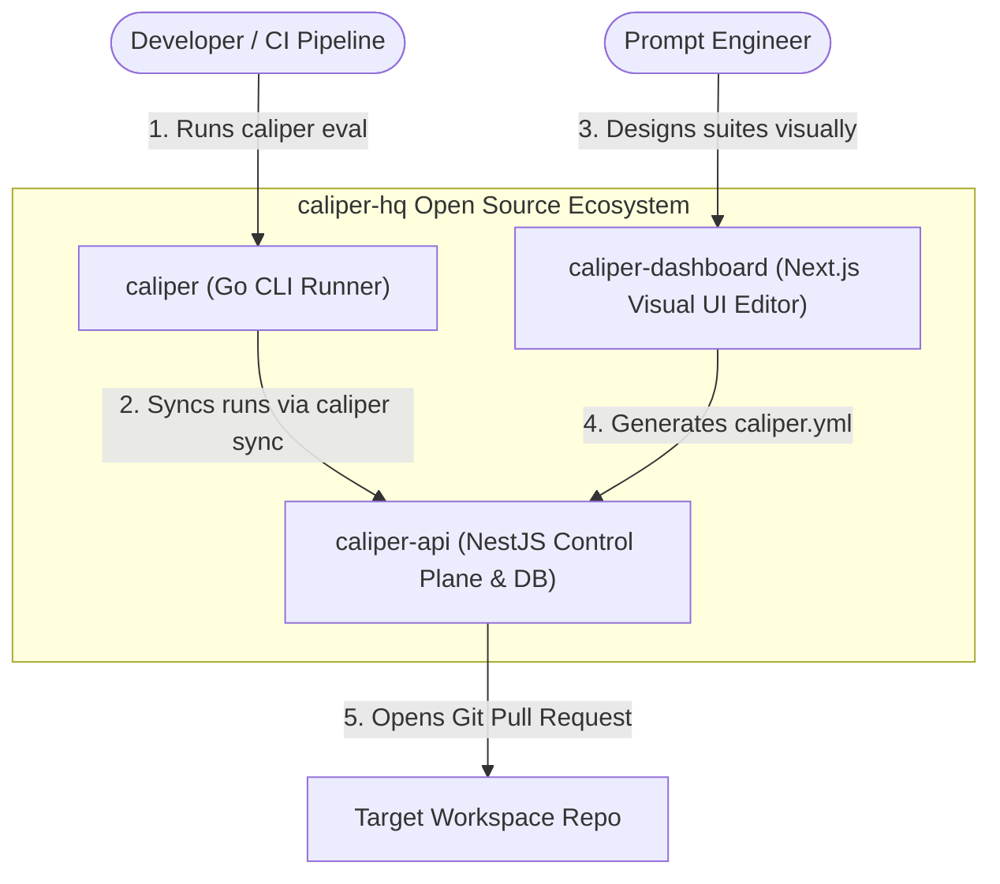

# `caliper`

[](LICENSE)
[](https://golang.org)
[](https://github.com/caliper-hq)

> **Git-Native LLM Evaluation Engine & Local Benchmark CLI**

**Caliper** is a lightweight, high-performance Go CLI designed to run evaluation benchmark suites against LLM models locally or in CI/CD pipelines. It uses declarative `caliper.yml` files stored directly in your Git repositories, ensuring test suites are version-controlled, auditable, and vendor-lock-in free.

---

## 🏗️ The Caliper Ecosystem (`caliper-hq`)



The Caliper ecosystem consists of 3 modular repositories:
1. **[`caliper`](https://github.com/caliper-hq/caliper)** (This repo): Standalone Go CLI tool to run local benchmarks and calculate pass rates, latencies (TTFT), and token costs.
2. **[`caliper-api`](https://github.com/caliper-hq/caliper-api)**: NestJS control plane API and PostgreSQL persistence layer for aggregated 30-day metrics & automated GitHub Pull Request creation.
3. **[`caliper-dashboard`](https://github.com/caliper-hq/caliper-dashboard)**: Next.js visual suite editor for designing prompt datasets, regex assertions, and semantic evaluation rules.

---

## ⚡ Quickstart

### 1. Installation

Build from source (requires Go 1.26+):

```bash
go build -o caliper ./cmd/caliper
```

Or install using Go:

```bash
go install github.com/caliper-hq/caliper/cmd/caliper@latest
```

### 2. Running an Evaluation Suite

Run local benchmarks against your configured `caliper.yml` suite:

```bash
caliper evaluate --config caliper.yml
```

### 3. Syncing Results to `caliper-api`

Push benchmark run metrics to your `caliper-api` instance:

```bash
export CALIPER_API_TOKEN=your-project-api-key
caliper sync --url http://localhost:3000 --project-id team-a
```

---

## 📄 License

Distributed under the Apache License 2.0. See `LICENSE` for more information.
