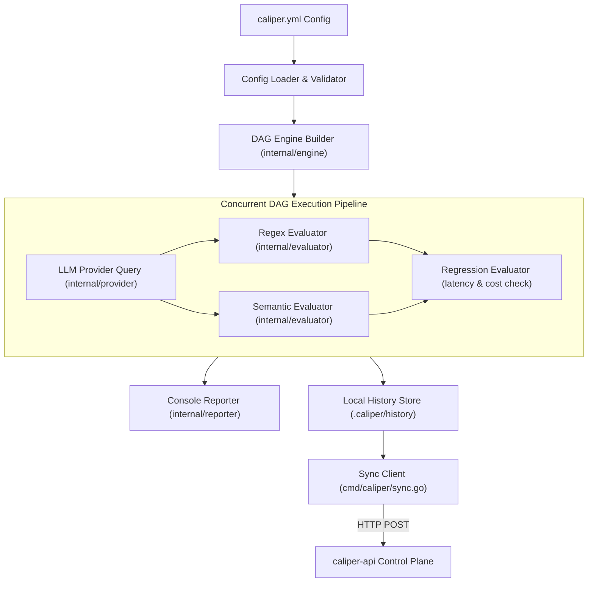

# `caliper`

[](https://github.com/caliper-hq/caliper/actions/workflows/ci.yml)
[](LICENSE)
[](https://golang.org)
[](https://github.com/caliper-hq)

> **High-Performance Go CLI & Concurrent DAG Engine for Local LLM Evaluation**

**`caliper`** is a fast, developer-first Go CLI tool designed to run evaluation benchmark suites against Large Language Model (LLM) providers locally or inside CI/CD runners. It compiles declarative YAML test suites (`caliper.yml`) into a **Directed Acyclic Graph (DAG)** of execution nodes, executing evaluations concurrently while enforcing quality assertions and performance regression thresholds.

---

## 🏛️ CLI Architecture & DAG Execution Model

Unlike simple sequential test scripts, `caliper` structures every test suite as an immutable dependency graph.



---

## ⚡ The Concurrent DAG Engine (`internal/engine`)

At the core of `caliper` is a concurrent **Directed Acyclic Graph (DAG) Engine**. When a test suite runs:

1. **Topology Validation**: The engine inspects node IDs, verifies dependencies, calculates node in-degrees, and builds a topological execution order. Circular dependencies are rejected before any API calls are made.
2. **Node Lifecycle State Machine**:
   - `statusPending`: Node is waiting for upstream dependencies to complete.
   - `statusReady`: Dependencies have satisfied assertions; worker goroutine is ready to spawn.
   - `statusRunning`: Execution is active in parallel goroutines.
   - `statusDone`: Evaluation finished; result published to `EvaluationContext`.
   - `statusSkipped`: Short-circuited because an upstream dependency failed.
3. **Goroutine-Level Parallelism**: Independent evaluation branches run concurrently across available CPU cores, sharing the LLM response without making redundant API calls.

---

## 🔍 Built-in Evaluator Types

| Evaluator Type | Description | Key Capabilities |
| :--- | :--- | :--- |
| **`regex`** | Pattern Matching | Evaluates response text against compiled regular expressions without re-querying the model. |
| **`semantic`** | Quality & Intent Assertions | Assesses response structure, keyword inclusion, and functional requirements. |
| **`regression`** | Performance Guardrails | Compares current run metrics (TTFT latency, cost in USD, pass rate) against historical baselines in `.caliper/history`. Fails if configured degradation thresholds (e.g., +15% latency) are exceeded. |

---

## 💾 Local Run Persistence (`.caliper/history`)

Every run automatically writes execution records to a local directory structure:

```text
.caliper/
└── history/
    └── 2026/
        └── 08/
            ├── run-code-generation-1785688553.json
            └── run-geography-qa-1785688553.json
```

- Enables **instant regression testing** without requiring an external database.
- Keeps full evaluation context, timestamps, token latencies, and pass rates on your local machine.

---

## 🛠️ CLI Commands & Usage

### 1. `caliper evaluate`

Executes an evaluation suite against a target dataset or configuration file.

```bash
# Run evaluation using default caliper.yml
caliper evaluate

# Run evaluation with a specific configuration file
caliper evaluate --config ./datasets/code-generation.yml
```

### 2. `caliper sync`

Transmits local run history to a remote [`caliper-api`](https://github.com/caliper-hq/caliper-api) control plane for team-wide telemetry and multi-tenant metric tracking.

```bash
# Set project API key in environment
export CALIPER_API_TOKEN=your-project-api-key

# Sync local runs to caliper-api endpoint
caliper sync --url http://localhost:3000 --project-id team-a
```

---

## 📋 Configuration Format (`caliper.yml`)

```yaml
version: "1.0"
suite: "code-generation-benchmark"
provider:
  type: "mock" # or "openai"
  model: "gpt-4o"
dataset:
  prompt: "Write a Go function that calculates Fibonacci numbers recursively."

evaluators:
  - id: "check_syntax"
    type: "regex"
    pattern: "func Fibonacci.*int"
    weight: 1.0

  - id: "performance_regression"
    type: "regression"
    depends_on: ["check_syntax"]
    thresholds:
      max_latency_increase_pct: 15.0
      max_cost_usd: 0.05
```

---

## 🚀 Installation & Building from Source

### Prerequisites
- **Go 1.26+**

### Install via Go CLI
```bash
go install github.com/caliper-hq/caliper/cmd/caliper@latest
```

### Build locally
```bash
# Clone the repository
git clone https://github.com/caliper-hq/caliper.git
cd caliper

# Build binary
go build -o caliper ./cmd/caliper

# Run tests
go test -v ./...
```

---

## 🌐 The Caliper Ecosystem (`caliper-hq`)

While `caliper` is a 100% standalone CLI tool, it seamlessly integrates with the rest of the **[`caliper-hq`](https://github.com/caliper-hq)** open-source ecosystem:

- **[`caliper-api`](https://github.com/caliper-hq/caliper-api)**: NestJS control plane & PostgreSQL metric storage for team metric tracking and automated Git PRs.
- **[`caliper-dashboard`](https://github.com/caliper-hq/caliper-dashboard)**: Next.js visual playground to design prompt datasets and evaluation rules.

---

## 📄 License

Distributed under the Apache License 2.0. See `LICENSE` for more information.
